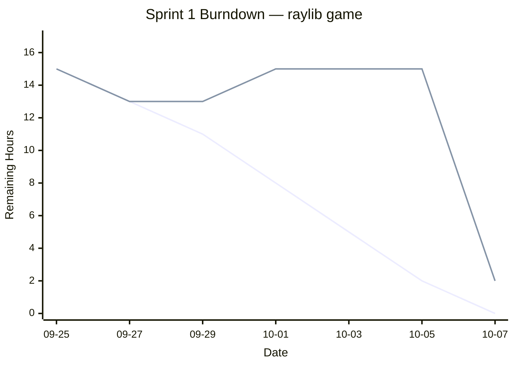

# Sprint 1 Deliverables (9/24–10/7)

  

**Project:** A (formerly) multiplayer video game where the player needs to avoid a player while accomplishing certain objectives.

  

**Team:**

-  **Product Owner:** Justin

-  **Scrum Master:** Mian

-  **Developers:** Javier, Kelly, Pradeepthi

  

---

  

## 1. Scrum Roles

-  **Product Owner:** Justin

Owns backlog, prioritization, lead decision-maker.

-  **Scrum Master:** Mian

Facilitates ceremonies, removes impediments.

-  **Developers:** Javier, Kelly, Pradeepthi

Full‑stack: C++ build, raylib.

  

---

  

## 2. Meeting Schedule

| Meeting | Date | Time | Notes |

|---------|------|------|-------|

| Sprint Planning | 2025-09-25 | 6:00 PM | Scope Sprint 1, define goal, estimate stories |

| Daily Scrum #1 | 2025-09-27 | 3:00 PM | Standup |

| Daily Scrum #2 | 2025-09-29 | 3:00 PM | Standup |

| Daily Scrum #3 | 2025-10-01 | 3:00 PM | Standup (mid‑sprint snapshot) |

| Daily Scrum #4 | 2025-10-03 | 3:00 PM | Standup |

| Daily Scrum #5 | 2025-10-05 | 3:00 PM | Standup |

| Sprint Retrospective | 2025-10-07 | 2:00 PM | 1‑page brief captured below |

  

---

  

## 3. Start‑of‑Sprint Snapshots (post‑Planning)

  

### 3.1 Product Backlog (start)

  
  

| ID | User Story & Acceptance Criteria | Hours | Notes |

|----|----------------------------------|-------|-------|

| P1 |  **As a user,** I should be able to connect to a server where the game should be hosted. **AC:** Program can connect to server. | 4 | Networking - Server |

| P2 |  **As a user,** my game should update and respond to actions performed by other players. **AC:** Server updates based on actions players take. | 4 | Networking - Game Integration |

| P3 |  **As a user,** the program should display something once I start it up. **AC:** Display a window using raylib. | 1 | Basic Game Loop |

| P4 |  **As a user,** I should have a character that I can use to play the game. **AC:** Display a character object with related sprites. | 2 | Player Characters |

| P5 |  **As a user,** I should see the area where the game takes place in. **AC:** A 2D array that is displayed by the game as a grid of tiles. | 2 | Tilemap |

| P6 |  **As a user,** I should be able to read and send messages in a text chat. **AC:** Send and display messages typed by the user. | 2 | Text Chat |

| P7 |  **As a user,** my character should be able to interact with objects in the game. **AC:** Player character can interact with items in the map. | 2 | Player Interactions |

| P8 |  **As a user,** I should be able to move my character in the game. **AC:** Move player character using keyboard inputs. | 2 | Player Movement |

| P9 |  **As a user,** I should hear sounds while playing the game. **AC:** Play sounds when certain events happen such as pressing a button. | 2 | Sound Effects |

| P10 |  **As a user,** my character should stop when encountering an obstacle. **AC:** Player character stops when coming into contact with a wall. | 2 | Enivornment Collision |

| P11 |  **As a user,** I should be able to switch between different levels in the game. **AC:** Save different 2D tilemaps and load them into the game. | 2 | Map Switching |

| P12 |  **As a user,** I should see both a timer showing how much time has passed and a value representing my score. **AC:** Timer for how long the player is playing, score that increases when user performs certain actions. | 2 | Timer and score |

  

**Total backlog hours (start):** 27

  

### 3.2 Sprint Goal

Have basic gameplay working as well as some server functionality and basic communication between players through the server.

  

### 3.3 Sprint Backlog (start)

  

| ID | Selected Story | PHours | Owner | Status (start) |

|----|----------------|--------|-------|----------------|

| P1 | Networking - Server | 4 | Justin | Not Started |

| P3 | Basic Game Loop | 1 | Justin | Not Started |

| P4 | Player Characters | 2 | Mian | Not Started |

| P5 | Tilemap | 2 | Javier | Not Started |

| P6 | Text Chat | 2 | Kelly | Not Started |

| P8 | Player Movement | 2 | Mian | Not Started |

| P9 | Sound Effects | 2 | Pradeepthi | Not Started |

  

**Committed hours:** 15

  

---

  

## 4. Mid‑Sprint Snapshot (10/1)

  

### 4.1 Sprint Backlog (midpoint)

| ID | Selected Story | Hours | Owner | Status (mid) | Notes |

|----|----------------|-------|-------|--------------|-------|

| P1 | Networking - Server | 4 | Justin | In progress |  |

| P3 | Basic Game Loop | 0 | Justin | Done | Created a test object that follows mouse cursor |

| P4 | Player Characters | 2 | Mian | In progress |  |

| P5 | Tilemap | 2 | Javier | Done | Basic tilemap created along with display function. |

| P6 | Text Chat | 2 | Kelly | In progress |  |

| P8 | Player Movement | 2 | Mian | In progress |  |

| P9 | Sound Effects | 2 | Pradeepthi | In progress |  |

| P10 | Environment Collision | 2 | Javier | Not started | Added to sprint backlog |

| P11 | Map Switching | 2 | Javier | Not started | Added to sprint backlog |

  

**Mid‑sprint changes:**

- Environment Collision and Map Switching added to sprint backlog

  

---

  

## 5. End‑of‑Sprint Snapshots

  

### 5.1 Product Backlog (end)

| ID | Story | Hours | Status (end) | Notes |

|----|-------|-------|--------------|-------|

| P1 | Networking - Server | 4 | In progress | Could not successfully integrate nbnet library into project |

| P2 | Networking - Game Integration | 4 | Not started |  |

| P3 | Basic Game Loop | 0 | Done |  |

| P4 | Player Characters | 0 | Done |  |

| P5 | Tilemap | 2 | Done | Tilemap saved in tilemap.cpp rather than main.cpp |

| P6 | Text Chat | 0 | Done | Worked fine on other machines |

| P7 | Player Interactions | 2 | Not started |  |

| P8 | Player Movement | 0 | Done | Some issues with collision to address. |

| P9 | Sound Effects | 0 | Done | Not working on other machines for some reason |

| P10 | Environment Collision | 2 | In progress | Collision with tilemap working with test object, not player |

| P11 | Map Switching | 0 | Done | Save and load tilemaps to and from text files. |

| P12 | Timer and Score | 2 | Not started |  |

  

**Remaining backlog after Sprint 1:** P1, P2, P7, P12

**Delivered hours:** 15

  

### 5.2 Sprint Backlog (end)

  

| ID | Story | Hours | Owner | Status (end) |

|----|-------|-------|-------|--------------|

| P1 | Networking - Server | 4 | Justin | In progress |

| P3 | Basic Game Loop | 1 | Justin | Done |

| P4 | Player Characters | 2 | Mian | Done |

| P5 | Tilemap | 2 | Javier | Done |

| P6 | Text Chat | 2 | Kelly | Done |

| P8 | Player Movement | 2 | Mian | Done |

| P9 | Sound Effects | 2 | Pradeepthi | Done |

| P10 | Environment Collision | 2 | Javier | Done |

| P11 | Map Switching | 2 | Javier | Done |

  

### 5.3 Burndown Chart (full sprint)

> Ideal vs. actual remaining hours. Scope was adjusted during mid-sprint to add more to backlog.

  

  

---

  

## 6. Retrospective

  

### What went well

-  **Solid groundwork:** Now that we have the basics, we can move on to more complex deliverables.

-  **Small steps:** Implementing small, simple features at the start allowed us to view progress on each part.

  

### What didn’t go well / impediments

-  **Networking:** P1 proved to be extremely difficult to integrate with raylib, may switch to a singleplayer game instead.

-  **Merging and Working Collaboratively:** Working together to merge our code proved to be difficult, a lot of time was spent trying to properly merge them.

  

### Improvements for next sprint (specific & actionable)

1.  **Merge Work Together:** Merge the remaining work from Sprint 1 so that all of the parts work with each other.

2.  **Definition of overall project:** Make clearer definition of what kind of game we want and our long-term goals.

3.  **Continuous Integration:** Learn how to implement continuous integration into our Github.

  

### Key learnings

- Networking is a lot more difficult than we anticipated it to be.

- Merging large amounts of code near the end causes many issues, better to merge small amounts throughout the sprint.

  

---