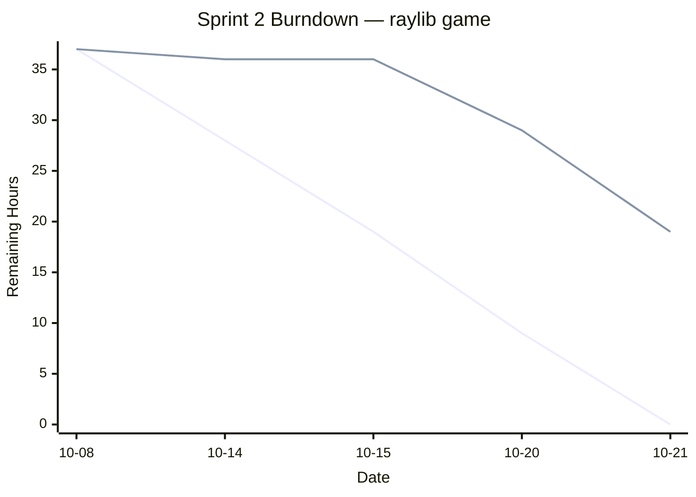

# Sprint 2 Deliverables (10/8–10/21)

  

**Project:** A singleplayer adventure game where the player avoids enemies and collects points!

## 1. Team  

-  **Product Owner:** Javier

-  **Scrum Master:** Justin

-  **Developers:** Mian, Kelly, Pradeepthi

---

  

## 2. Meeting Schedule

|Meeting|Date|Time|
|-------|----|----|
|Sprint Planning|2025-10-09|6:00 PM|Figured out the sprint backlog and assigned work|
|Daily Scrum #1|2025-10-14|4:00 PM|Quick check-in after break|
|Daily Scrum #2|2025-10-15|2:00 PM|Met in-class|

---

  

## 3. Start‑of‑Sprint Snapshots (post‑Planning)

  

### 3.1 Product Backlog (start)

  
  
|ID|	User Story and Acceptance Criteria|	Hours|
|--|--------------------------------------|------|
|P1|	**As a user,** the enemies in the world should track my position and find the path towards me. **AC:** Path-finding algorithm implemented, can find a path to any tile in world.|	4|
|P2|	**As a designer,** I should be able to place and delete terrain tiles and save/load changes from file. **AC:** Saving and loading implemented. Editing with mouse.|	4|
|P3|	"**As a user,** I should be able to interact with other game objects in the world. **AC:** Basic object collisions implemented."|	4|
|P4|	"**As a designer,** I should be able to give any game object animated graphics using an AnimatedSprite object. **AC:** Specifications sketched out"|	4|
|P5|	"**As a user,** I should be greeted by a main menu upon opening the game. **AC:** Title screen with start button that boots into main ame loop"|	4|
|P6|	"**As a user,** I should be able to pause the game. **AC:** Game objects do not update while paused, basic overlay."|	4|
|P7|	"**As a user,** I should be able to collect items to increase my score. **AC:** Score display, functions for modifying, object that increases score"|	4|

**Total backlog hours (start):** 28

  

### 3.2 Sprint Goal

Have some basic game mechanics

  

### 3.3 Sprint Backlog (start)

  

|Tasks|	Assigned To| Hours|
|-----|------------|------|
|Basic Enemy AI|	Javier|	4|
|Tilemap Graphical Editor|	Javier|	4|
|Clean up Sprint 1 Code|	Justin|	1|
|Hitbox and Hurtbox|	Justin|	4|
|Generic Sprite Animations for Objects|	Justin/Mian|	4|
|Continuous Integration|	Mian|	4|
|Main Menu|	Kelly|	4|
|Pausing Behavior and Screen|	Kelly|	4|
|Score and Timer Functionality|	Pradeepthi|	4|
|Collectible Game Object|	Pradeepthi|	4|

  
**Committed hours:** 37

  

---

  

## 4. Mid‑Sprint Snapshot (10/1)

  

### 4.1 Sprint Backlog (midpoint)
|Tasks|	Assigned To| Hours|
|-----|------------|------|
|Basic Enemy AI|	Javier|	5|
|Tilemap Graphical Editor|	Javier|	4|
|Clean up Sprint 1 Code|	Justin|	0|
|Hitbox and Hurtbox|	Justin|	4|
|Generic Sprite Animations for Objects|	Justin/Mian|	4|
|Continuous Integration|	Justin/Mian|	3|
|Main Menu|	Kelly|	2|
|Pausing Behavior and Screen|	Kelly|	1|
|Score and Timer Functionality|	Pradeepthi|	4|
|Collectible Game Object|	Pradeepthi|	4|

  

**Mid‑sprint changes:**
Justin joined in on Continuous Integrated

  

---

## 5. End‑of‑Sprint Snapshots

  

### 5.1 Product Backlog (end)
|ID|	User Story and Acceptance Criteria|	Hours|
|--|--------------------------------------|------|
|P1|	**As a user,** the enemies in the world should track my position and find the path towards me. **AC:** Path-finding algorithm implemented, can find a path to any tile in world.|	0|
|P2|	**As a designer,** I should be able to place and delete terrain tiles and save/load changes from file. **AC:** Saving and loading implemented. Editing with mouse.|	4|
|P3|	"**As a user,** I should be able to interact with other game objects in the world. **AC:** Basic object collisions implemented."|	4|
|P4|	"**As a designer,** I should be able to give any game object animated graphics using an AnimatedSprite object. **AC:** Specifications sketched out"|	4|
|P5|	"**As a user,** I should be greeted by a main menu upon opening the game. **AC:** Title screen with start button that boots into main ame loop"|	0|
|P6|	"**As a user,** I should be able to pause the game. **AC:** Game objects do not update while paused, basic overlay."|   0|
|P7|	"**As a user,** I should be able to collect items to increase my score. **AC:** Score display, functions for modifying, object that increases score"|	4|

  

**Remaining backlog after Sprint:** P2, P3, P4, P7

**Delivered hours:** 18

  

### 5.2 Sprint Backlog (end)
|Tasks|	Assigned To| Hours|
|-----|------------|------|
|Basic Enemy AI|	Javier|	0|
|Tilemap Graphical Editor|	Javier|	4|
|Clean up Sprint 1 Code|	Justin|	0|
|Hitbox and Hurtbox|	Justin|	4|
|Generic Sprite Animations for Objects|	Justin/Mian|	4|
|Continuous Integration|	Justin/Mian|	0|
|Main Menu|	Kelly|	0|
|Pausing Behavior and Screen|	Kelly|	0|
|Score and Timer Functionality|	Pradeepthi|	4|
|Collectible Game Object|	Pradeepthi|	4|
  
  

### 5.3 Burndown Chart (full sprint)

---

  

## 6. Retrospective

Had issues merging our work in the end, again. Need to be pushing our work more frequently.

Continuous Integration gave us some weird issues and it's hard coming up with functionality to test.

Didn't get a lot of work done because of the break causing relaxation.
  
---