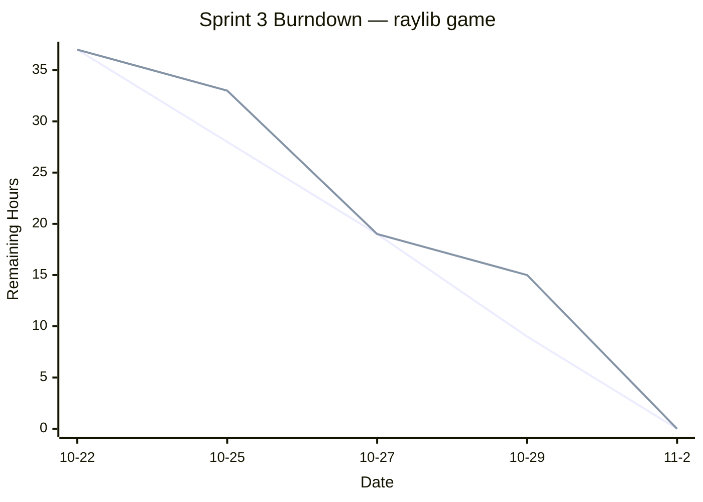

# Sprint 3 Deliverables (10/22–11/5)

  

**Project:** A singleplayer adventure game where the player avoids enemies and collects points!

## 1. Team  

-  **Product Owner:** Mian

-  **Scrum Master:** Javier

-  **Developers:** Justin, Kelly, Pradeepthi

---

  

## 3. Meeting Schedule

|Meeting|Date|Time|
|-------|----|----|
|Sprint Planning|2025-10-22|3:15 PM|Quick discussion about sprint backlog and tasks|
|Daily Scrum #1|2025-10-25|7:30 PM|Quick check-in on progress|
|Daily Scrum #2|2025-10-27|3:15 PM|Met after class|
|Daily Scrum #3|2025-10-29|2:00 PM|Met in-class|
|Daily Scrum #4|2025-11-2|4:00 PM|Quick check-in on progress|

---

  

## 3. Start‑of‑Sprint Snapshots (post‑Planning)

  

### 3.1 Product Backlog (start)

  
  
|ID|	User Story and Acceptance Criteria|	Hours|
|--|--------------------------------------|------|
|P1|	**As a user,** the enemies in the world should move towards my player character as I'm playing. **AC:** Use A Star algorithm to have enemy objects follow the player.|	4|
|P2|	**As a designer,** I should be able to place and delete terrain tiles and save/load changes from file. **AC:** Saving and loading implemented. Editing with mouse.|	4|
|P3|	"**As a user,** I should see one player character and one or more enemy characters. **AC:** One player character and one or more enemy characters should be visible on the board.|	4|
|P4|	"**As a user,** my player character should die when coming into contact with an enemy. **AC:** Player character is killed when coming into contact with an enemy, resulting in a game over.|	4|
|P5|	**As a designer,** I should have tiles that correspond with different game functions. **AC:** Tiles corresponding with player start position, enemy start position, and coin start position.|	4|
|P6|	"**As a user,** I should be able to access the game through a menu screen, as well as pause the game. **AC:** Menu screen and pause screen should work alongside main game loop.|	4|
|P7|	"**As a user,** there should be some way to win the game, as well as a way to lose. **AC:** Win condition when player collects all coins, lose condition when player encounters an enemy.|	4|
|P8|	"**As a user,** there should be multiple levels that can be loaded into the game to play. **AC:** Multiple level tilemaps can be saved and loaded into the game.|	4|
|P9|	**As a designer,** I should be able to use Github Actions to help with continuous integration. **AC:** More fleshed out continuous integration system.|	4|
|P10|	"**As a user,** I should be able to read through the ReadMe file of the project to tell me hot to install, run, and use the program. **AC:** ReadMe file gives instrictions on what the project is, requirements to run the project, how to install and run it, and how to use the program.|	1|

**Total backlog hours (start):** 37

  

### 3.2 Sprint Goal

Get our game to a state where it is playable.

  

### 3.3 Sprint Backlog (start)

  

|Tasks|	Assigned To| Hours|
|-----|------------|------|
|Enemy moves towards player|	Justin/Mian|	4|
|Tilemap Graphical Editor|	Justin|	4|
|Player and enemies|	Justin|	4|
|Player death|	Justin|	4|
|More game tiles|	Javier|	4|
|Main menu and pause screens integration|	Kelly/Mian|	4|
|Win and lose conditions|	Pradeepthi|	4|
|Tilemap saving and loading|	Javier|	4|
|CI/CD| Kelly|	4|
|ReadMe file|	Javier|	1|

  
**Committed hours:** 37

  

---

  

## 4. Mid‑Sprint Snapshot (10/29)

  

### 4.1 Sprint Backlog (midpoint)
|Tasks|	Assigned To| Hours|
|-----|------------|------|
|Enemy moves towards player|	Justin/Mian|	0|
|Tilemap Graphical Editor|	Justin|	4|
|Player and enemies|	Justin|	2|
|Player death|	Justin|	2|
|More game tiles|	Javier|	2|
|Main menu and pause screens integration|	Kelly/Mian|	0|
|Win and lose conditions|	Pradeepthi|	2|
|Tilemap saving and loading|	Javier|	2|
|CI/CD| Kelly|	4|
|ReadMe file|	Javier|	1|

  

**Mid‑sprint changes:**

  

---

## 5. End‑of‑Sprint Snapshots

  

### 5.1 Product Backlog (end)
|ID|	User Story and Acceptance Criteria|	Hours|
|--|--------------------------------------|------|
|P1|	**As a user,** the enemies in the world should move towards my player character as I'm playing. **AC:** Use A Star algorithm to have enemy objects follow the player.|	0|
|P2|	**As a designer,** I should be able to place and delete terrain tiles and save/load changes from file. **AC:** Saving and loading implemented. Editing with mouse.|	0|
|P3|	"**As a user,** I should see one player character and one or more enemy characters. **AC:** One player character and one or more enemy characters should be visible on the board.|	0|
|P4|	"**As a user,** my player character should die when coming into contact with an enemy. **AC:** Player character is killed when coming into contact with an enemy, resulting in a game over.|	0|
|P5|	**As a designer,** I should have tiles that correspond with different game functions. **AC:** Tiles corresponding with player start position, enemy start position, and coin start position.|	0|
|P6|	"**As a user,** I should be able to access the game through a menu screen, as well as pause the game. **AC:** Menu screen and pause screen should work alongside main game loop.|	0|
|P7|	"**As a user,** there should be some way to win the game, as well as a way to lose. **AC:** Win condition when player collects all coins, lose condition when player encounters an enemy.|	0|
|P8|	"**As a user,** there should be multiple levels that can be loaded into the game to play. **AC:** Multiple level tilemaps can be saved and loaded into the game.|	0|
|P9|	**As a designer,** I should be able to use Github Actions to help with continuous integration. **AC:** More fleshed out continuous integration system.|	4|
|P10|	"**As a user,** I should be able to read through the ReadMe file of the project to tell me hot to install, run, and use the program. **AC:** ReadMe file gives instrictions on what the project is, requirements to run the project, how to install and run it, and how to use the program.|	0|

  

**Remaining backlog after Sprint:** 

**Delivered hours:** 33

  

### 5.2 Sprint Backlog (end)
### 4.1 Sprint Backlog (midpoint)
|Tasks|	Assigned To| Hours|
|-----|------------|------|
|Enemy moves towards player|	Justin/Mian|	0|
|Tilemap Graphical Editor|	Justin|	0|
|Player and enemies|	Justin|	0|
|Player death|	Justin|	0|
|More game tiles|	Javier|	0|
|Main menu and pause screens integration|	Kelly/Mian|	0|
|Win and lose conditions|	Pradeepthi|	0|
|Tilemap saving and loading|	Javier|	0|
|CI/CD| Kelly|	0|
|ReadMe file|	Javier|	0|
  
  

### 5.3 Burndown Chart (full sprint)

---

  

## 6. Retrospective

Conflicting schedules led to some difficulty with scheduling our initial meetings

Lack of communication led to multiple group members performing the same task
  
---