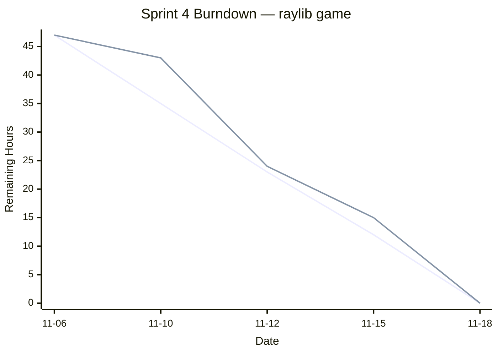

# Sprint 4 Deliverables (11/06–11/18)

  

**Project:** A singleplayer adventure game where the player avoids enemies and collects points!

## 1. Team  

-  **Product Owner:** Pradeepthi

-  **Scrum Master:** Kelly

-  **Developers:** Justin, Javier , Mian

---

  

## 2. Meeting Schedule

|Meeting|Date|Time|
|-------|----|----|
|Sprint Planning|2025-11-06|6:00 PM|Quick discussion about sprint backlog and tasks|
|Daily Scrum #1|2025-11-10|3:15 PM|Quick check-in on progress in class|
|Daily Scrum #2|2025-11-12|2:00 PM|Met in class|
|Daily Scrum #3|2025-11-15|2:00 PM|Quick check-in on progress|
|Daily Scrum #4|2025-11-18|4:00 PM|Quick check-in on progress|

---

  

## 3. Start‑of‑Sprint Snapshots (post‑Planning)

  

### 3.1 Product Backlog (start)

  
  
|ID|	User Story and Acceptance Criteria|	Hours|
|--|--------------------------------------|------|
|P1|	"**As a user,** I should see graphics in the world instead of a plain background. **AC:** Background texture drawn; repeating wall textures implemented."|	4|
|P2|	"**As a user,** I should see enemies with directional sprites like the player. **AC:** Multi-direction enemy sprite implemented."|	4|
|P3|	"**As a designer,** I should have a menu for the level editor. **AC:** Pause-menu-like screen; can immediately load the level for play-test; can pause and return to editor."|	4|
|P4|	"**As a user,** I should see an end-level or end-game screen when a level or all levels are completed. **AC:** Static screen appears when all coins are collected; allows input to proceed; final end-game screen appears when all levels beaten."|	4|
|P5|	"**As a developer,** I should have global variables organized in a single header. **AC:** playerPtr, enemies list, collectables, tilemap, gameState, etc. are all in global.hpp and accessible anywhere."|	4|
|P6|	"**As a user,** I should hear more sound effects and music. **AC:** Additional sounds and optional music added; sounds accessible globally."|	4|
|P7|	"**As a user,** I should have a level select screen. **AC:** Menu lists levels; selecting a level loads it into the game."|	4|
|P8|	"**As a user,** I should be able to adjust the game volume. **AC:** Volume settings implemented and applied to all sounds."|	4|
|P9|	"**As a user,** I should see more information on the HUD. **AC:** Additional HUD elements added, e.g., stats."|	4|

**Total backlog hours (start):** 36

  

### 3.2 Sprint Goal

Finalize our game and sort through any errors. 

  

### 3.3 Sprint Backlog (start)

  

|Tasks|	Assigned To| Hours|
|-----|------------|------|
|Add graphics to world|	Justin|	2|
|Add graphics to enemy|	Javier|	4|
|Menu for level editor|	Javier|	4|
|End level screen/end game screen|	Justin|	2|
|Refactor globals|	Justin|	2|
|Add more sounds| Mian|	4|
|Level select screen|	Javier|	4|
|Settings Screen|	Kelly|	2|
|Add more info to the HUD| Pradeepthi|	4|
|ReadMe file|	Kelly|	1|

  
**Committed hours:** 29

  

---

  

## 4. Mid‑Sprint Snapshot (10/29)

  

### 4.1 Sprint Backlog (midpoint)
|Tasks|	Assigned To| Hours|
|-----|------------|------|
|Add graphics to world|	Justin|	1|
|Add graphics to enemy|	Javier|	2|
|Menu for level editor|	Javier|	2|
|End level screen/end game screen|	Justin|	1|
|Refactor globals|	Justin|	1|
|Add more sounds| Mian|	2|
|Level select screen|	Javier|	2|
|Settings Screen|	Kelly|	1|
|Add more info to the HUD| Pradeepthi|	2|
|ReadMe file|	Kelly|	1|

  

**Mid‑sprint changes:**

  

---

## 5. End‑of‑Sprint Snapshots

  

### 5.1 Product Backlog (end)
|ID|	User Story and Acceptance Criteria|	Hours|
|--|--------------------------------------|------|
|P1|	"**As a user,** I should see graphics in the world instead of a plain background. **AC:** Background texture drawn; repeating wall textures implemented."|	0|
|P2|	"**As a user,** I should see enemies with directional sprites like the player. **AC:** Multi-direction enemy sprite implemented."|	0|
|P3|	"**As a designer,** I should have a menu for the level editor. **AC:** Pause-menu-like screen; can immediately load the level for play-test; can pause and return to editor."|	0|
|P4|	"**As a user,** I should see an end-level or end-game screen when a level or all levels are completed. **AC:** Static screen appears when all coins are collected; allows input to proceed; final end-game screen appears when all levels beaten."|	0|
|P5|	"**As a developer,** I should have global variables organized in a single header. **AC:** playerPtr, enemies list, collectables, tilemap, gameState, etc. are all in global.hpp and accessible anywhere."|	0|
|P6|	"**As a user,** I should hear more sound effects and music. **AC:** Additional sounds and optional music added; sounds accessible globally."|	0|
|P7|	"**As a user,** I should have a level select screen. **AC:** Menu lists levels; selecting a level loads it into the game."|	0|
|P8|	"**As a user,** I should be able to adjust the game volume. **AC:** Volume settings implemented and applied to all sounds."|	0|
|P9|	"**As a user,** I should see more information on the HUD. **AC:** Additional HUD elements added, e.g., stats."|	0|
  

**Remaining backlog after Sprint:**  None

**Delivered hours:** 29

  

### 5.2 Sprint Backlog (end)
|Tasks|	Assigned To| Hours|
|-----|------------|------|
|Add graphics to world|	Justin|	0|
|Add graphics to enemy|	Javier|	0|
|Menu for level editor|	Javier|	0|
|End level screen/end game screen|	Justin|	0|
|Refactor globals|	Justin|	0|
|Add more sounds| Mian|	0|
|Level select screen|	Javier|	0|
|Settings Screen|	Kelly|	0|
|Add more info to the HUD| Pradeepthi|	0|
|ReadMe file|	Kelly|	0|
  
  

### 5.3 Burndown Chart (full sprint)

---

  

## 6. Retrospective

What went well:

We communicated better throughout this sprint than others. This was due to an early planning meeting and constant messsaging through Discord that kept everyone on track. 

All pieces came together to complete the final product. We didn't have any parts that we couldn't integrate by the deadline like in some past sprints.

What could be improved:

We could improve on completing things ahead of time rather than finishing up last minute. This can help avoid any confusion on what is left to be completed. 

---